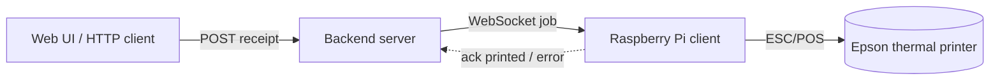

# Remote Thermo Printer

Print receipts on an Epson (ESC/POS) thermal printer from anywhere.

A small **backend** accepts receipts (ReceiptLine markdown, text, images, PDFs)
over an HTTP API or a built‑in web UI and queues them. A lightweight **client**
runs on a Raspberry Pi next to the printer, keeps a WebSocket open to the
backend, and prints every job the moment it arrives using
[python-escpos](https://github.com/python-escpos/python-escpos).



## Features

- **ReceiptLine markdown** via [receiptline](https://github.com/receiptline/receiptline)
  for receipt tables, rules, barcodes and QR codes.
- **Three basic content types**: formatted **text**, **images**
  (PNG/JPEG/GIF/BMP) and **PDF** (every page is rendered and printed).
- **Push printing**: jobs are delivered instantly over a persistent WebSocket.
- **Reliable delivery**: jobs submitted while the printer is offline are queued;
  un‑acknowledged jobs are requeued if the client drops (at‑least‑once).
- **Multiple printers**: target a specific printer by id or broadcast to all.
- **Many printer backends**: USB, network, serial, raw device file, CUPS, or a
  `dummy` printer for testing without hardware.
- **Web UI** for quickly creating receipts, plus a CLI example and a JSON API.
- **Authentication**: static tokens for the printer device and API scripts, plus
  **Gitea OIDC login** for web-UI users (with optional user / org-team allow-lists).
- **Automatic client updates**: the Pi client pulls new code from the backend
  over the WebSocket and reloads itself — no SSH or manual restart.

## Project layout

```
common/   shared wire protocol (Pydantic models) used by both sides
server/   FastAPI backend: HTTP API, WebSocket endpoint, web UI
client/   Raspberry Pi client: WebSocket loop + python-escpos rendering
examples/ command-line sender
```

## Installation

Requires Python 3.9+.

**Backend** (any always-on machine):

```bash
pip install ".[server]"
npm install
```

ReceiptLine rendering runs through the upstream Node.js package, so the backend
host also needs Node.js available on `PATH`.

**Client** (the Raspberry Pi attached to the printer):

```bash
pip install ".[client]"
```

On the Pi a few system packages help with USB and PDF rendering:

```bash
sudo apt install libusb-1.0-0   # USB printers
# PyMuPDF ships wheels for 64-bit Raspberry Pi OS; no extra packages needed.
```

For local development with the end-to-end smoke test, install everything:

```bash
pip install ".[dev]"
```

## Configuration

Copy `.env.example` to `.env` and edit it. Backend reads `RTP_SERVER_*`, the
client reads `RTP_CLIENT_*`; both can share one file.

Key client settings:

| Variable | Meaning |
| --- | --- |
| `RTP_CLIENT_SERVER_URL` | Backend WebSocket URL, e.g. `ws://host:8000/ws` |
| `RTP_CLIENT_CONNECTION` | `usb` \| `network` \| `serial` \| `file` \| `cups` \| `dummy` |
| `RTP_CLIENT_PRINTER_ID` | Unique id used to target this printer |
| `RTP_CLIENT_PRINTER_WIDTH` | Print head width in dots (80mm≈576, 58mm≈384) |
| `RTP_CLIENT_TOKEN` | Printer token (must match `RTP_SERVER_PRINTER_TOKEN`) |

Per-connection settings (USB vendor/product id, network host/port, serial
device, etc.) are documented inline in `.env.example`.

## Running the backend

```bash
rtp-server          # or: python -m server
```

Then open <http://localhost:8000> for the web UI. The API listens on the same
host/port.

### With Docker

A `Dockerfile` for the backend is included (the web UI is bundled in the image):

```bash
docker build -t remote-thermo-printer-server .
docker run -p 8000:8000 remote-thermo-printer-server
```

Configure it via environment variables (and/or a mounted `.env`):

```bash
docker run -p 8000:8000 \
  -e RTP_SERVER_TOKEN=secret \
  remote-thermo-printer-server
# or mount a .env file:
docker run -p 8000:8000 -v "$PWD/.env:/app/.env:ro" remote-thermo-printer-server
```

The image runs as a non-root user and exposes port 8000 with a `/api/health`
healthcheck. Point your Raspberry Pi client at `ws://<docker-host>:8000/ws`.

## Running the client (Raspberry Pi)

```bash
rtp-client          # or: python -m client
```

Example for a USB Epson printer:

```bash
export RTP_CLIENT_SERVER_URL=ws://192.168.1.10:8000/ws
export RTP_CLIENT_CONNECTION=usb
export RTP_CLIENT_USB_VENDOR_ID=0x04b8
export RTP_CLIENT_USB_PRODUCT_ID=0x0202
rtp-client
```

Find your USB ids with `lsusb` (Epson's vendor id is usually `04b8`). For a
networked printer set `RTP_CLIENT_CONNECTION=network` and `RTP_CLIENT_NET_HOST`.

### Run the client as a service

Create `/etc/systemd/system/rtp-client.service`:

```ini
[Unit]
Description=Remote Thermo Printer client
After=network-online.target
Wants=network-online.target

[Service]
WorkingDirectory=/home/pi/remote-thermo-printer
EnvironmentFile=/home/pi/remote-thermo-printer/.env
ExecStart=/home/pi/remote-thermo-printer/.venv/bin/rtp-client
Restart=always
RestartSec=3
User=pi

[Install]
WantedBy=multi-user.target
```

```bash
sudo systemctl enable --now rtp-client
```

## Automatic client updates

The client keeps itself in sync with the backend over the same WebSocket — no
SSH, `git pull` or manual restart on the Pi.

How it works:

1. On connect the client reports a fingerprint (`bundle_revision`) of its
   running `client` + `common` source.
2. If the backend ships different code, it streams the new source bundle back.
3. The client verifies every file (SHA-256 + it must compile), writes them
   atomically, then **re-execs itself** — the systemd unit keeps running, the
   client reconnects, and now runs the new code.

So whenever you deploy a new backend image (the client source is bundled into
it), every connected printer upgrades itself on its next reconnect. In-flight
jobs are safe: delivery is at-least-once, so anything not yet acknowledged is
requeued across the brief reload.

Notes:

- The device must already be running a build that understands updates (this
  feature). Bootstrap once with `pip install ".[client]"`; afterwards updates
  are automatic.
- Disable per side with `RTP_SERVER_AUTO_UPDATE=false` (stop offering) or
  `RTP_CLIENT_AUTO_UPDATE=false` (receive jobs but ignore updates).
- The client install location must be writable by the service user. Updates add
  or overwrite files; they never delete code the backend no longer ships.
- Check what the backend serves: `GET /api/client/version`.

## HTTP API

The HTTP API accepts **either** a logged-in web session (see
[Authentication](#authentication)) **or** a static API token via
`Authorization: Bearer <token>`, an `X-Token` header, or a `?token=` query
parameter. Auth is only enforced when a token or OIDC login is configured.

| Method | Path | Description |
| --- | --- | --- |
| `GET` | `/api/health` | Liveness + counts only (no auth) |
| `GET` | `/api/auth/config` | Which auth options are enabled (no auth) |
| `GET` | `/api/me` | The current logged-in user |
| `GET` | `/auth/login` | Start the Gitea OIDC login |
| `GET` | `/auth/logout` | Clear the session |
| `GET` | `/api/printers` | Connected printers |
| `GET` | `/api/jobs?limit=N` | Recent jobs and their state |
| `POST` | `/api/receipts` | Submit a full receipt (JSON, see below) |
| `POST` | `/api/receipts/text` | Quick text receipt |
| `POST` | `/api/receipts/receiptline` | Submit ReceiptLine markdown |
| `POST` | `/api/upload` | Upload an image or PDF (multipart form) |
| `WS` | `/ws` | Printer client connection (printer token) |

A full receipt is a list of elements:

```jsonc
{
  "receipt": {
    "title": "Order #1234",
    "cut": true,
    "elements": [
      { "type": "text", "content": "ACME Corp", "align": "center", "bold": true,
        "double_width": true, "double_height": true },
      { "type": "text", "content": "Thank you!\n" },
      { "type": "image", "data": "<base64 png/jpg>", "align": "center" },
      { "type": "pdf",   "data": "<base64 pdf>", "dpi": 203 }
    ]
  },
  "target": null            // null = all connected printers, or a printer id
}
```

Quick text receipt:

```bash
curl -X POST http://localhost:8000/api/receipts/text \
  -H 'Content-Type: application/json' \
  -d '{"text":"Hello world","align":"center","bold":true}'
```

ReceiptLine markdown:

```bash
curl -X POST http://localhost:8000/api/receipts/receiptline \
  -H 'Content-Type: application/json' \
  -d '{"doc":"Asparagus | 0.99\nBroccoli | 1.99\n---\n^TOTAL | ^2.98","cpl":42}'
```

Upload an image or PDF:

```bash
curl -X POST http://localhost:8000/api/upload \
  -F file=@logo.png -F align=center
```

## Command-line sender

```bash
python examples/send_receipt.py text "Hello world" --center --bold
python examples/send_receipt.py image logo.png
python examples/send_receipt.py pdf invoice.pdf --dpi 203
# point elsewhere / authenticate:
python examples/send_receipt.py --server http://192.168.1.10:8000 --token secret \
    text "Hi" --target pi-printer-1
```

## Authentication

Three kinds of caller authenticate differently:

| Caller | Mechanism | Configure with |
| --- | --- | --- |
| **Printer device** (Raspberry Pi) | static printer token in the WebSocket hello | `RTP_SERVER_PRINTER_TOKEN` = `RTP_CLIENT_TOKEN` |
| **API scripts / CI** | static bearer token on HTTP requests | `RTP_SERVER_API_TOKEN` |
| **Web-UI users** (humans) | Gitea OIDC login (session cookie) | `RTP_SERVER_OIDC_*` |

`RTP_SERVER_TOKEN` is a convenient fallback used for both the printer and the
API when the more specific tokens are unset. With nothing configured the API is
open (handy on a trusted LAN).

### Gitea OIDC login

1. In Gitea go to **Settings -> Applications -> Create OAuth2 application**.
   - **Redirect URI**: `<public-url>/auth/callback`
     (e.g. `https://printer.example.com/auth/callback`).
   - To restrict by org/team, grant the application the **groups** claim.
2. Configure the backend:

   ```bash
   RTP_SERVER_OIDC_ENABLED=true
   RTP_SERVER_OIDC_ISSUER=https://git.example.com
   RTP_SERVER_OIDC_CLIENT_ID=<client id>
   RTP_SERVER_OIDC_CLIENT_SECRET=<client secret>
   RTP_SERVER_PUBLIC_URL=https://printer.example.com
   RTP_SERVER_SESSION_SECRET=<long random string>
   # optional allow-lists (empty = any authenticated Gitea user):
   RTP_SERVER_OIDC_ALLOWED_USERS=alice,bob@example.com
   RTP_SERVER_OIDC_ALLOWED_GROUPS=myorg,myorg:printer-admins
   ```

3. Open the web UI and click **Login with Gitea**. After login the session
   cookie authorizes API calls from the browser automatically.

Serve the backend over HTTPS (set `RTP_SERVER_PUBLIC_URL` to the `https://` URL)
so the session cookie is marked `Secure`. Behind a reverse proxy, forward the
original `Host` / `X-Forwarded-Proto` headers.

## Notes

- **Image & PDF sizing**: images and rendered PDF pages wider than
  `RTP_CLIENT_PRINTER_WIDTH` dots are scaled down to fit the paper.
- **PDF rendering** uses PyMuPDF (`pymupdf`). Each page becomes one bitmap.
- **Security**: set `RTP_SERVER_PRINTER_TOKEN` (and the matching
  `RTP_CLIENT_TOKEN`) plus an `RTP_SERVER_API_TOKEN` and/or Gitea OIDC login when
  the backend is reachable beyond a trusted LAN, and terminate TLS (`wss://`,
  `https://`) with a reverse proxy in front of the backend.
- **Testing without hardware**: keep `RTP_CLIENT_CONNECTION=dummy`; the client
  acknowledges jobs as printed without touching a device.

## License

MIT
